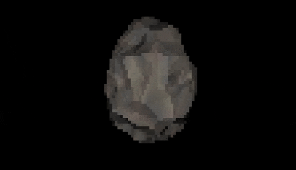

My attempt at a software renderer that outputs to the console, entirely from scratch.

**Current state**: rasterizing and coloring obj files.

My goals:
- Learn some basic linear algebra
- Have the engine be reasonably fast and correct
- Understand all of the code that I'm writing
