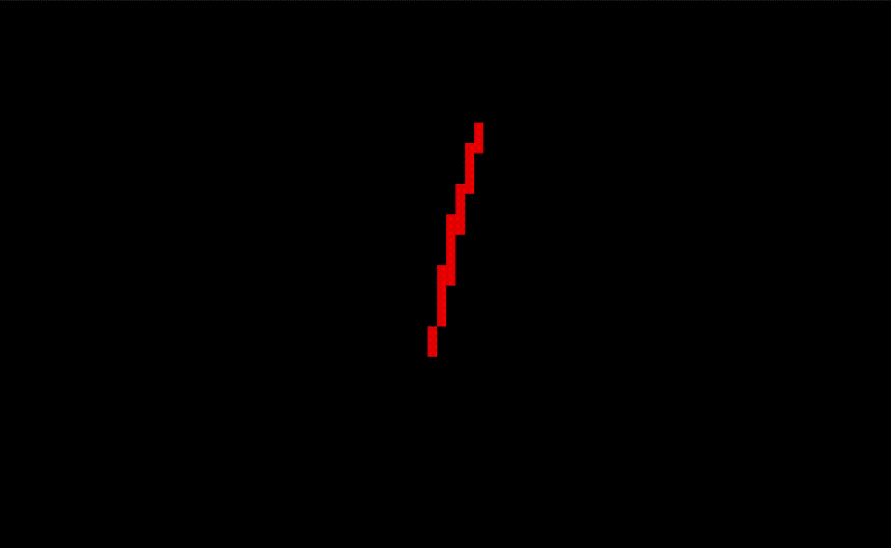

My attempt at a 3D rendering engine that outputs to the console.

**Current state**: rendering and rotating wireframe triangles.

My goals:
- Learn some basic linear algebra
- Have the engine be reasonably fast and correct
- Understand all of the code that I'm writing
