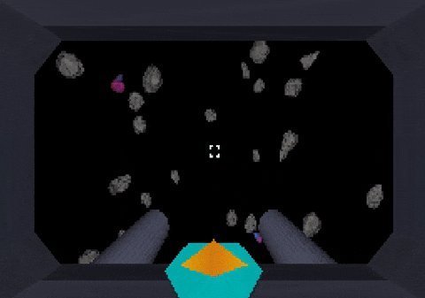

# Terminal Velocity

The year is 2525. You're yet another expendable contractor, assigned to one of the deadliest jobs in the galaxy: crystal extraction from unstable asteroid belts deep in space. Armed with only your teleportation blasters, you'll have to harvest as many alien crystals as possible before the asteroids accelerate faster than you can react. One collision, and it's over...

This game was my Computer Science 30 final project. It's made entirely from scratch in C++, including the software rasterizer, the game engine, and the game itself. It runs in the terminal with just about zero extra dependencies on most Linux systems.



## 🟢 Current State
- Renders and transforms meshes loaded from OBJ files
- Colors based on vertex colors and barycentric weights
    - Can make decent looking objects, like the asteroid, crystals, and HUD shown
- Has basic shading, z-buffering, etc.
- Can move the camera around in the world from input
- Shoot asteroids using space to destroy them
- HUD arrow guides you by pointing forwards
- Asteroids kill the player when they get too close
- PPM image rendering capability

## 🎯 Goals
- Learn some basic linear algebra
- Have the engine be reasonably fast and correct
- Understand all of the code that I'm writing
    - I now realize that this was quite ambitious
- Avoid requiring non-standard libraries

## ⚙️ How to run
- **Linux Only!**
- Modify your keyboard settings: increase repeat rate and decrease repeat delay as much as possible
    - This is the only way to semi-accurately handle real-time input in the terminal
- Decrease your terminal text size to fit the engine's resolution
- In the project directory, run:
```bash
make
./main
```

## 💬 Comments
- Consider using a particularly fast terminal like kitty
- Speed limitations are almost definitely a result of terminal throughput
